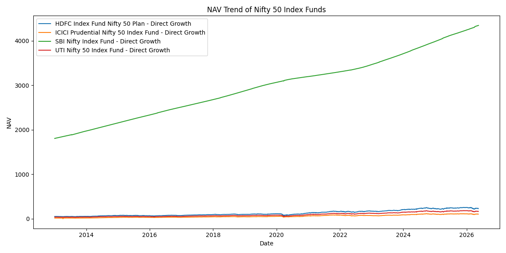
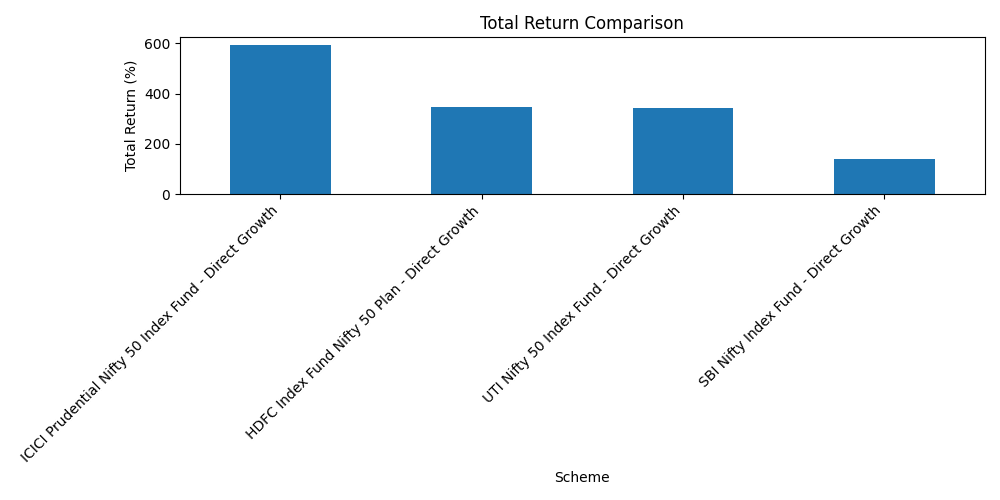
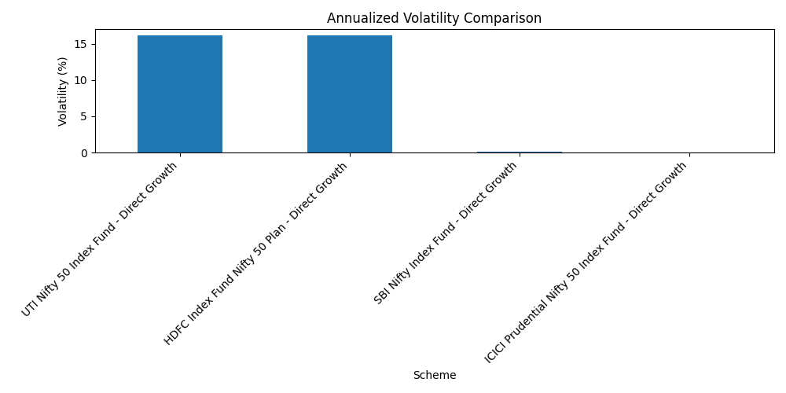
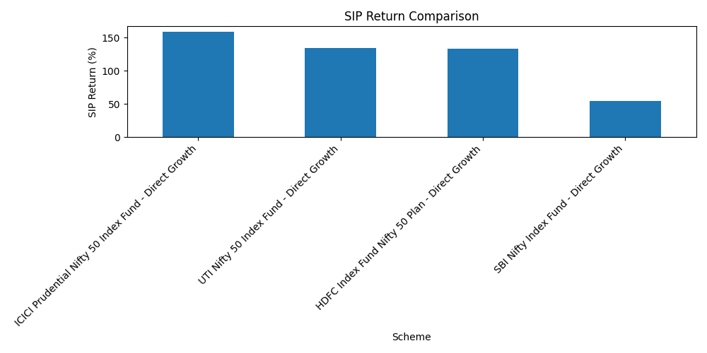

# Mutual Fund Performance Analysis using MFAPI Data

## Overview

This project analyzes historical NAV data of selected Nifty 50 index mutual funds using real mutual fund data fetched from MFAPI.

The main goal of this project is to compare mutual fund performance using important financial and analytical metrics such as total return, volatility, maximum drawdown, NAV trend, and SIP-style investment simulation.

This project follows a complete data analytics workflow:

- Data collection
- Data cleaning
- Exploratory data analysis
- Data visualization
- Metric calculation
- Insight generation
- Business interpretation

The project is designed to show how real financial data can be converted into useful investment insights using Python, SQL, and data analysis techniques.

---

## Objective

The objective of this project is to answer practical investment-focused questions such as:

- Which mutual fund generated the highest return?
- Which fund showed the highest volatility?
- Which fund had the largest maximum drawdown?
- How did NAV values move over time?
- What would be the result of a monthly SIP investment?
- Which fund appeared more stable during the selected period?
- How can mutual fund comparison be made more data-driven?

---

## Data Source

The dataset is collected using **MFAPI**, a public API that provides historical NAV data for Indian mutual fund schemes.

This project focuses on selected Nifty 50 index mutual funds because they follow the same benchmark, which makes performance comparison more meaningful.

Selected schemes include:

- UTI Nifty 50 Index Fund - Direct Growth
- HDFC Index Fund Nifty 50 Plan - Direct Growth
- ICICI Prudential Nifty 50 Index Fund - Direct Growth
- SBI Nifty Index Fund - Direct Growth

---

## Tools and Technologies Used

| Tool / Technology | Purpose |
|---|---|
| Python | Main programming language used for data collection and analysis |
| Pandas | Data cleaning, transformation, and analysis |
| NumPy | Numerical calculations |
| Matplotlib | Data visualization |
| Requests | Fetching data from MFAPI |
| SQL | Querying and analyzing structured data |
| CSV | Storing raw, cleaned, and summary data |

---

## Project Structure

```text
mutual-fund-performance-analysis/
├── data/
│   ├── raw/
│   │   └── nav_data.csv
│   └── cleaned/
│       └── cleaned_nav_data.csv
├── images/
│   ├── nav_trend.png
│   ├── returns_comparison.png
│   ├── volatility_comparison.png
│   └── sip_simulation.png
├── reports/
│   ├── summary_metrics.csv
│   └── insights.md
├── scripts/
│   ├── fetch_nav_data.py
│   └── analyze_nav_data.py
├── sql/
│   └── nav_queries.sql
├── README.md
└── requirements.txt
```

---

## Analysis Performed

The project performs the following analysis:

1. Fetches historical NAV data using MFAPI.
2. Stores raw NAV data in CSV format.
3. Cleans and formats the NAV dataset.
4. Converts date and NAV columns into proper data types.
5. Compares NAV trends across selected mutual funds.
6. Calculates total return percentage for each fund.
7. Calculates annualized volatility using daily returns.
8. Calculates maximum drawdown for each fund.
9. Simulates a monthly SIP investment.
10. Generates visualizations for comparison.
11. Saves summary metrics and insights for reporting.

---

## Key Metrics Calculated

| Metric | Description |
|---|---|
| Total Return Percentage | Measures how much the fund grew from the first available NAV to the last available NAV |
| Annualized Volatility | Measures the level of fluctuation in NAV values over time |
| Maximum Drawdown | Measures the largest fall from a previous peak NAV |
| SIP Return Percentage | Measures the return generated through a simulated monthly SIP |
| Current SIP Value | Shows the final value of all SIP investments |
| NAV Movement | Shows how the NAV changed during the selected time period |

---

## Visualizations

The project generates the following visualizations:

### NAV Trend Comparison

Shows how the NAV of each selected fund moved over time.

### Return Comparison

Compares the total return percentage of each mutual fund.

### Volatility Comparison

Compares the annualized volatility of each fund to understand risk levels.

### Maximum Drawdown Comparison

Shows the largest decline each fund experienced from a previous peak.

### SIP Simulation

Shows how a monthly SIP investment would have performed across selected funds.

All generated charts are saved inside the `images/` directory.

---

## Results and Visual Analysis

This section shows the main outputs generated from the mutual fund performance analysis.

---

### 1. NAV Trend Comparison

The NAV trend chart compares how the selected Nifty 50 index mutual funds moved over time.

Since all selected funds track the Nifty 50 index, their NAV movement is expected to be broadly similar.



---

### 2. Total Return Comparison

This chart compares the total return percentage of each selected mutual fund during the analysis period.

Total return was calculated using the first available NAV and the latest available NAV.



---

### 3. Volatility Comparison

This chart compares the annualized volatility of each fund.

Volatility measures how much the NAV fluctuated over time. A higher volatility means larger NAV movement, while lower volatility indicates relatively more stable performance.



---

### 4. Maximum Drawdown Comparison

Maximum drawdown shows the largest fall from a previous peak NAV.

This metric helps understand downside risk during weak market periods.


---

### 5. SIP Simulation Result

This chart shows the result of a simulated monthly SIP investment.

The simulation assumes a fixed monthly investment amount and calculates the final investment value using accumulated units and the latest NAV.



---

## Summary Metrics

The analysis generates a summary report containing important fund-level metrics.

| Metric | Meaning |
|---|---|
| Total Return Percentage | Overall growth from first NAV to latest NAV |
| Annualized Volatility | Yearly risk level based on daily return fluctuations |
| Maximum Drawdown | Largest percentage fall from a previous peak |
| SIP Invested Amount | Total amount invested through monthly SIP |
| SIP Current Value | Final value of accumulated SIP units |
| SIP Return Percentage | Return generated through SIP investment |

The summary metrics are saved in:

```text
reports/summary_metrics.csv
```
---

## Business Relevance

This project is useful for fintech and investment platforms because it helps answer important user-facing questions such as:

- Which fund has performed better historically?
- Which fund is more stable?
- How risky is a fund based on past NAV movement?
- How much could a monthly SIP have grown?
- How can fund comparison be made clearer for retail investors?

Instead of comparing funds only through returns, this analysis also considers risk and investment behavior.

This makes the analysis more practical for real-world investment decision-making.

---

## Key Insights

- The selected mutual funds showed similar NAV movement because they all track the Nifty 50 index.
- Return differences between the funds were relatively small, which is expected for index funds.
- Volatility helped identify which funds had larger daily NAV fluctuations.
- Maximum drawdown helped measure downside risk during market corrections.
- SIP simulation provided a more realistic view of investment performance for retail investors.
- A complete fund comparison should include both return and risk metrics.

---

## How to Run the Project

### 1. Clone the Repository

```bash
git clone <your-repository-url>
cd mutual-fund-performance-analysis
```

### 2. Install Dependencies

```bash
pip install -r requirements.txt
```

### 3. Fetch NAV Data

```bash
python scripts/fetch_nav_data.py
```

### 4. Run the Analysis

```bash
python scripts/analyze_nav_data.py
```

---

## Output

After running the project, the following outputs are generated:

| Output | Location |
|---|---|
| Raw NAV dataset | `data/raw/` |
| Cleaned NAV dataset | `data/cleaned/` |
| Charts and visualizations | `images/` |
| Summary metrics | `reports/` |
| Insights report | `reports/insights.md` |

---

## Example Output Files

```text
data/raw/nav_data.csv
data/cleaned/cleaned_nav_data.csv
images/nav_trend.png
images/returns_comparison.png
images/volatility_comparison.png
images/sip_simulation.png
reports/summary_metrics.csv
reports/insights.md
```

---

## Possible Improvements

This project can be improved further by adding:

- Streamlit dashboard for interactive fund comparison
- More mutual fund categories
- Direct benchmark comparison with Nifty 50
- Expense ratio comparison
- Tracking error analysis
- Rolling return analysis
- Sharpe Ratio calculation
- Sortino Ratio calculation
- Fund size comparison
- Category-wise fund comparison
- Automated report generation

---

## Conclusion

This project shows how real mutual fund NAV data can be collected, cleaned, analyzed, and converted into meaningful investment insights.

The analysis proves that mutual fund comparison should not be based only on returns. Risk metrics such as volatility, maximum drawdown, and SIP performance are also important for understanding fund behavior.

By combining performance metrics, risk metrics, visualizations, and business interpretation, this project demonstrates a practical data analytics workflow for financial data analysis.
